# NeoConnect Complaint Management System – Frontend

The **NeoConnect Frontend** is a modern web interface built using **Next.js 14, React, and TailwindCSS**.
It provides users, staff, secretariat, and administrators with an intuitive platform to submit complaints, track cases, participate in polls, and analyze complaint data.

The frontend communicates with a **Node.js + Express REST API backend** and visualizes complaint management workflows through dashboards and analytics.

---

# System Architecture

The NeoConnect platform follows a **full-stack architecture** where the frontend communicates with a REST API backend that manages business logic and database operations.


---

# Tech Stack

Frontend technologies used in the project:

* **Next.js 14**
* **React**
* **TailwindCSS**
* **Axios**
* **ShadCN UI Components**
* **Lucide Icons**
* **Context API**

---

# Project Structure

```text
frontend
│
├── docs
│   └── screenshots
│       ├── architecture.png
│       ├── admin.dashboard.png
│       ├── admin.analytics.png
│       ├── admin.allcases.png
│       ├── admin.addpoll.png
│       ├── admin.hub.png
│       ├── admin.usermanagement.png
│       ├── casemanager.dashboard.png
│       ├── staff.dashboard.png
│       ├── staff.case.png
│       ├── Secretariat.dashboard.png
│       ├── Secretariat.assign.png
│       ├── login.page.png
│       └── register.page.png
│
├── src
│   ├── app
│   ├── components
│   ├── context
│   ├── lib
│   ├── utils
│   └── styles
│
└── README.md
```

---

# Key Features

### User Authentication

Users can securely register and log in to access the system.

### Complaint Submission

Users can submit complaints through structured forms.

### Case Tracking

Users can monitor the status and progress of their submitted complaints.

### Role-Based Dashboards

Different dashboards are available for:

* **Admin**
* **Case Manager**
* **Secretariat**
* **Staff**

Each role has dedicated permissions and system capabilities.

### Poll Management

Admins can create polls and collect responses from users.

### Complaint Analytics

Dashboards display complaint statistics and system performance metrics.

---

# Application Screenshots

## Login Page

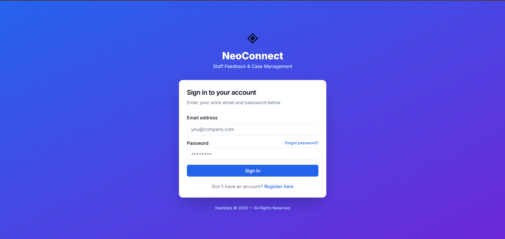

---

## Register Page

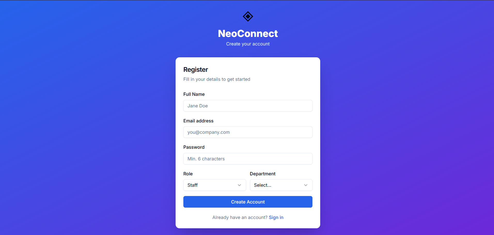

---

## Admin Dashboard

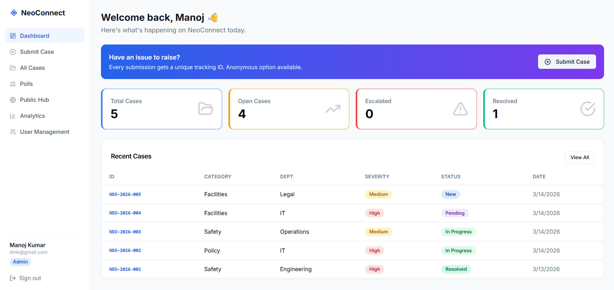

---

## Admin Analytics

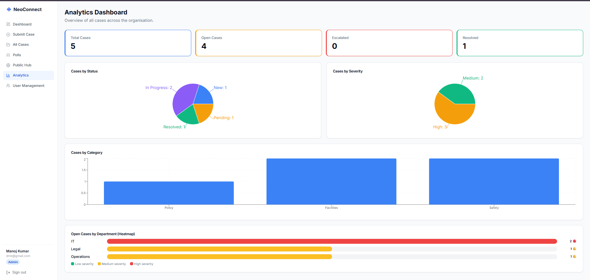

---

## Admin – All Cases

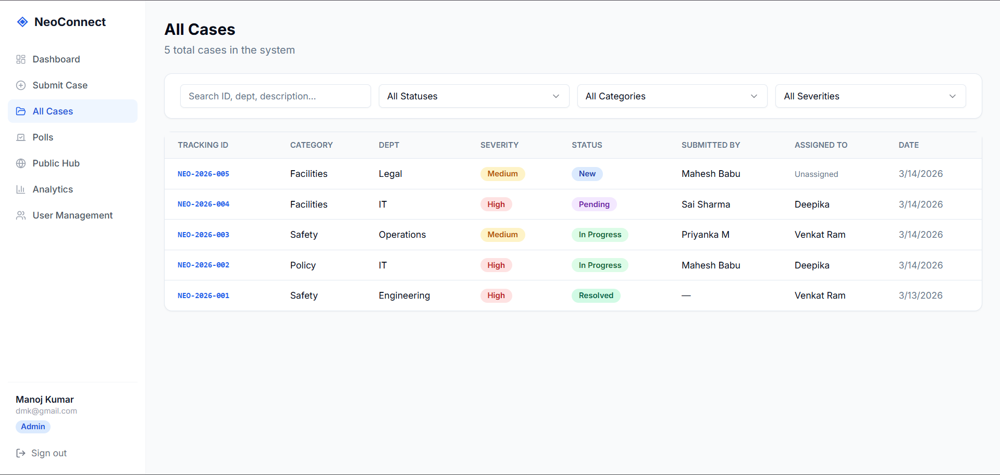

---

## Admin – Add Poll

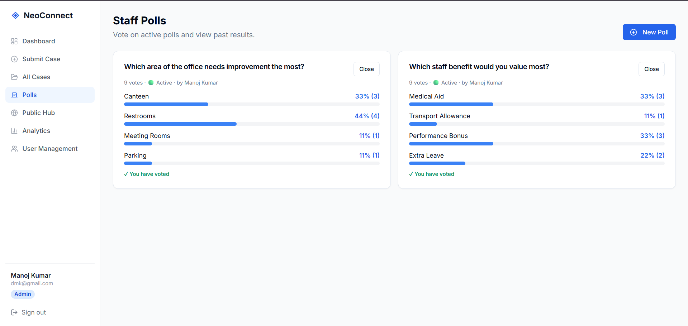

---

## Admin – Hub

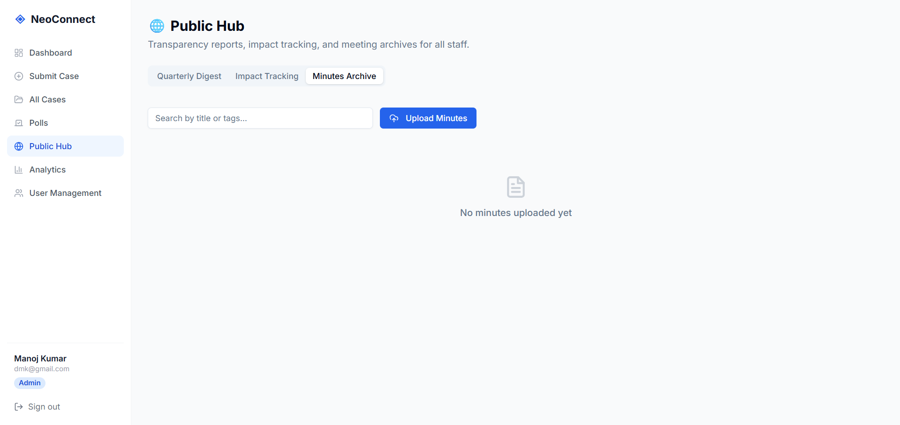

---

## Admin – User Management

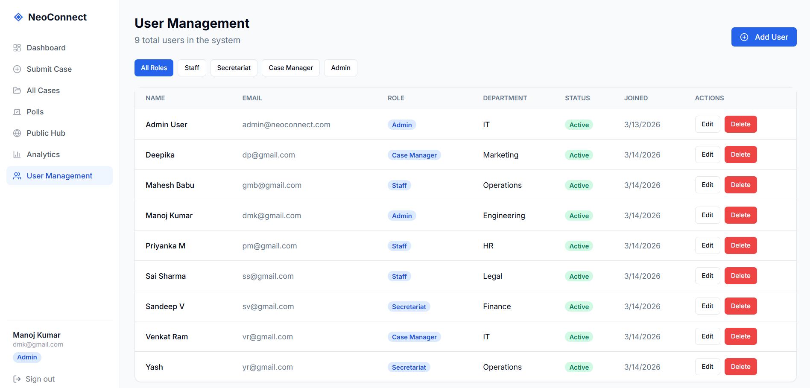

---

## Case Manager Dashboard

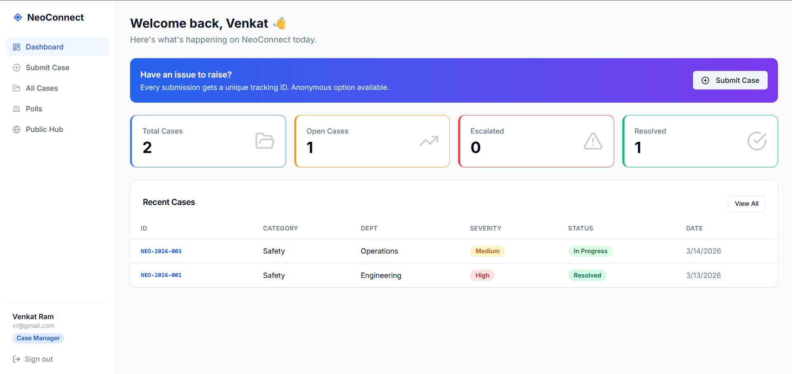

---

## Secretariat Dashboard

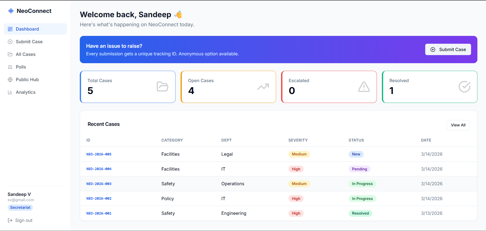

---

## Secretariat – Assign Case

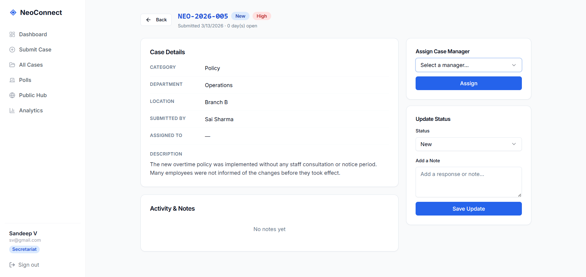

---

## Staff Dashboard

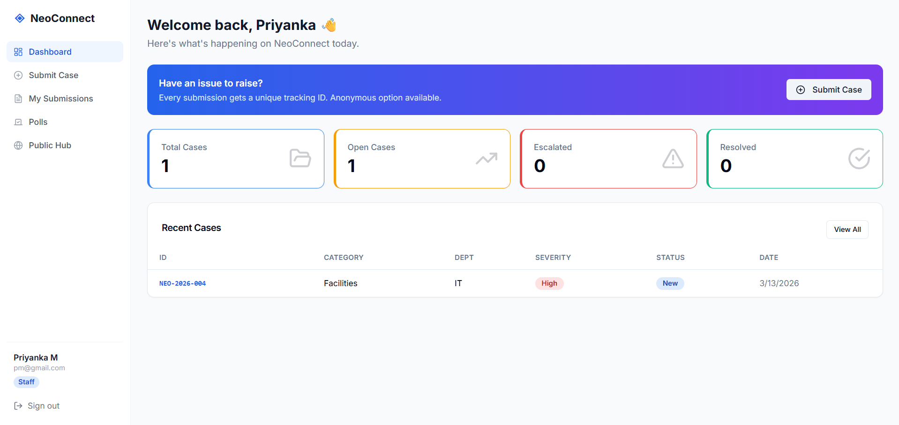

---

## Staff Case Management

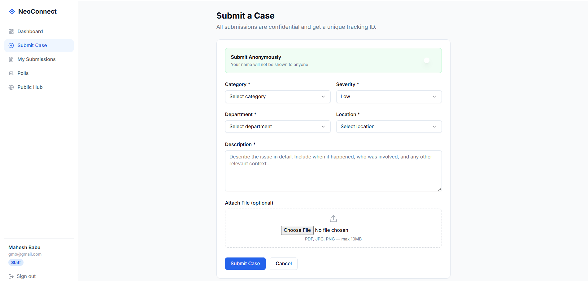

---

# Installation

Clone the repository

```bash
git clone https://github.com/yourusername/neoconnect-frontend.git
```

Navigate to the project

```bash
cd neoconnect-frontend
```

Install dependencies

```bash
npm install
```

---

# Run the Application

Start the development server

```bash
npm run dev
```

Application will run at:

```
http://localhost:3000
```

---

# API Communication

The frontend communicates with the backend REST API using **Axios**.

Example request:

```javascript
axios.get("/api/cases")
```

---

# Future Improvements

Possible enhancements:

* Real-time notifications
* Mobile optimized UI
* Advanced analytics
* Dark mode
* Email alerts

---

# Author

Developed as part of the **NeoConnect Complaint Management System**.
